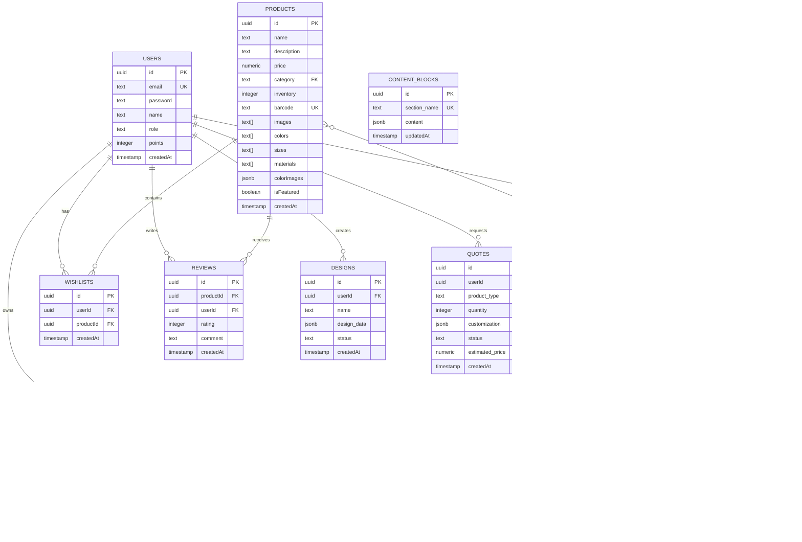

# SportHelem - Documentación Técnica Completa

## Tabla de Contenidos

1. [Resumen Ejecutivo](#resumen-ejecutivo)
2. [Arquitectura del Sistema](#arquitectura-del-sistema)
3. [Stack Tecnológico](#stack-tecnológico)
4. [Base de Datos](#base-de-datos)
5. [Servicios Backend](#servicios-backend)
6. [Componentes Frontend](#componentes-frontend)
7. [Páginas y Rutas](#páginas-y-rutas)
8. [Características Principales](#características-principales)
9. [Guía de Instalación](#guía-de-instalación)
10. [Guía de Uso](#guía-de-uso)
11. [API Reference](#api-reference)
12. [Seguridad](#seguridad)
13. [Despliegue](#despliegue)
14. [Mantenimiento](#mantenimiento)

---

## 1. Resumen Ejecutivo

**SportHelem** es una plataforma e-commerce completa desarrollada con Next.js 15 y Supabase, especializada en productos deportivos personalizados. La aplicación incluye funcionalidades avanzadas como:

- Sistema de autenticación y roles (Admin/Cliente)
- Gestión completa de productos con códigos de barras
- Carrito de compras y checkout
- Sistema de gamificación con puntos y recompensas
- Diseños personalizados
- Inventario rápido con scanner de códigos
- PWA con modo offline
- Sistema de cupones y descuentos
- Gestión de categorías con actualización en cascada

### Métricas del Proyecto
- **Líneas de código:** ~15,000+
- **Componentes:** 28
- **Servicios:** 14
- **Páginas:** 23+
- **Tablas de BD:** 12

---

## 2. Arquitectura del Sistema

### 2.1 Arquitectura General

```
┌─────────────────────────────────────────────────────────┐
│                    CLIENTE (Browser)                     │
│  ┌──────────────┐  ┌──────────────┐  ┌──────────────┐  │
│  │   Next.js    │  │   React 18   │  │  TailwindCSS │  │
│  │   Frontend   │  │  Components  │  │    Styling   │  │
│  └──────────────┘  └──────────────┘  └──────────────┘  │
└─────────────────────────────────────────────────────────┘
                          ↕ HTTP/REST
┌─────────────────────────────────────────────────────────┐
│                   CAPA DE SERVICIOS                      │
│  ┌──────────────────────────────────────────────────┐  │
│  │  Product │ Auth │ Order │ Barcode │ Points │ ... │  │
│  └──────────────────────────────────────────────────┘  │
└─────────────────────────────────────────────────────────┘
                          ↕ PostgREST
┌─────────────────────────────────────────────────────────┐
│                    SUPABASE BACKEND                      │
│  ┌──────────────┐  ┌──────────────┐  ┌──────────────┐  │
│  │  PostgreSQL  │  │     Auth     │  │   Storage    │  │
│  │   Database   │  │   Service    │  │   Service    │  │
│  └──────────────┘  └──────────────┘  └──────────────┘  │
└─────────────────────────────────────────────────────────┘
```

### 2.2 Patrón de Diseño

**Arquitectura:** Layered Architecture (Capas)

```
┌─────────────────────────────────┐
│     Presentation Layer          │  ← Pages & Components
├─────────────────────────────────┤
│     Business Logic Layer        │  ← Services & Contexts
├─────────────────────────────────┤
│     Data Access Layer           │  ← CRUD Operations
├─────────────────────────────────┤
│     Database Layer              │  ← Supabase PostgreSQL
└─────────────────────────────────┘
```

**Patrones Utilizados:**
- **Service Pattern:** Encapsulación de lógica de negocio
- **Context API:** Gestión de estado global
- **HOC (Higher-Order Components):** Reutilización de lógica
- **Composition:** Componentes reutilizables

---

## 3. Stack Tecnológico

### 3.1 Frontend

| Tecnología | Versión | Propósito |
|------------|---------|-----------|
| **Next.js** | 15.2.4 | Framework React con SSR |
| **React** | 18 | Librería UI |
| **TypeScript** | 5 | Tipado estático |
| **Tailwind CSS** | 4 | Styling utility-first |
| **Radix UI** | Latest | Componentes accesibles |
| **Lucide React** | 0.454.0 | Iconos |
| **Framer Motion** | 12.23.24 | Animaciones |
| **Sonner** | 1.7.1 | Notificaciones toast |

### 3.2 Backend & Database

| Tecnología | Versión | Propósito |
|------------|---------|-----------|
| **Supabase** | 2.84.0 | Backend as a Service |
| **PostgreSQL** | Latest | Base de datos relacional |
| **PostgREST** | 1.19.4 | API REST automática |

### 3.3 Librerías Especializadas

| Librería | Propósito |
|----------|-----------|
| **html5-qrcode** | Scanner de códigos de barras |
| **jsbarcode** | Generación de códigos de barras |
| **jspdf** | Generación de PDFs |
| **react-medium-image-zoom** | Zoom de imágenes |
| **date-fns** | Manipulación de fechas |
| **zod** | Validación de esquemas |

### 3.4 Herramientas de Desarrollo

- **ESLint:** Linting de código
- **Autoprefixer:** CSS vendor prefixes
- **Turbopack:** Bundler ultra-rápido

---

## 4. Base de Datos

### 4.1 Esquema de Base de Datos

#### Diagrama ER



### 4.2 Tablas Principales

#### 4.2.1 `products`
Almacena información de productos.

**Campos:**
- `id` (UUID, PK): Identificador único
- `name` (TEXT, NOT NULL): Nombre del producto
- `description` (TEXT): Descripción detallada
- `price` (NUMERIC, NOT NULL): Precio
- `category` (TEXT): Categoría del producto
- `inventory` (INTEGER): Stock disponible
- `image` (TEXT): URL imagen principal
- `images` (TEXT[]): Array de URLs de imágenes
- `colors` (TEXT[]): Colores disponibles
- `sizes` (TEXT[]): Tallas disponibles
- `materials` (TEXT[]): Materiales
- `colorImages` (JSONB): Mapeo color-imagen
- `isFeatured` (BOOLEAN): Producto destacado
- `barcode` (TEXT, UNIQUE): Código de barras
- `createdAt` (TIMESTAMP): Fecha de creación

**Índices:**
- `idx_products_barcode` en `barcode`

#### 4.2.2 `users`
Gestión de usuarios y autenticación.

**Campos:**
- `id` (UUID, PK)
- `email` (TEXT, UNIQUE, NOT NULL)
- `password` (TEXT, NOT NULL)
- `name` (TEXT)
- `role` (TEXT): 'customer' | 'admin'
- `points` (INTEGER): Puntos de gamificación
- `createdAt` (TIMESTAMP)

#### 4.2.3 `orders`
Registro de pedidos.

**Campos:**
- `id` (UUID, PK)
- `userId` (UUID, FK)
- `total` (NUMERIC, NOT NULL)
- `status` (TEXT): 'pending' | 'completed' | 'cancelled'
- `paymentMethod` (TEXT)
- `shippingAddress` (JSONB)
- `items` (JSONB): Array de productos
- `createdAt` (TIMESTAMP)

#### 4.2.4 `categories`
Categorías de productos.

**Campos:**
- `id` (UUID, PK)
- `name` (TEXT, NOT NULL)
- `slug` (TEXT, UNIQUE)
- `image` (TEXT)
- `is_active` (BOOLEAN)
- `createdAt` (TIMESTAMP)

#### 4.2.5 `coupons`
Sistema de cupones y descuentos.

**Campos:**
- `id` (UUID, PK)
- `code` (TEXT, UNIQUE)
- `userId` (UUID, FK)
- `discount` (NUMERIC)
- `isUsed` (BOOLEAN)
- `usedAt` (TIMESTAMP)
- `orderId` (UUID, FK)
- `createdAt` (TIMESTAMP)

#### 4.2.6 `reviews`
Reseñas de productos.

**Campos:**
- `id` (UUID, PK)
- `productId` (UUID, FK)
- `userId` (UUID, FK)
- `rating` (INTEGER): 1-5
- `comment` (TEXT)
- `createdAt` (TIMESTAMP)

#### 4.2.7 `wishlists`
Lista de deseos de usuarios.

**Campos:**
- `id` (UUID, PK)
- `userId` (UUID, FK)
- `productId` (UUID, FK)
- `createdAt` (TIMESTAMP)

#### 4.2.8 `designs`
Diseños personalizados de clientes.

**Campos:**
- `id` (UUID, PK)
- `userId` (UUID, FK)
- `name` (TEXT)
- `design_data` (JSONB)
- `status` (TEXT): 'draft' | 'submitted' | 'approved' | 'rejected'
- `createdAt` (TIMESTAMP)

#### 4.2.9 `quotes`
Cotizaciones de productos personalizados.

**Campos:**
- `id` (UUID, PK)
- `userId` (UUID, FK)
- `product_type` (TEXT)
- `quantity` (INTEGER)
- `customization` (JSONB)
- `status` (TEXT): 'pending' | 'quoted' | 'accepted' | 'rejected'
- `estimated_price` (NUMERIC)
- `createdAt` (TIMESTAMP)

#### 4.2.10 `content_blocks`
Contenido dinámico del sitio.

**Campos:**
- `id` (UUID, PK)
- `section_name` (TEXT, UNIQUE)
- `content` (JSONB)
- `updatedAt` (TIMESTAMP)

### 4.3 Row Level Security (RLS)

**Políticas Implementadas:**

```sql
-- Products: Todos pueden ver, solo admins modifican
CREATE POLICY "Products viewable by everyone" ON products FOR SELECT USING (true);
CREATE POLICY "Only admins can insert products" ON products FOR INSERT WITH CHECK (auth.role() = 'admin');

-- Users: Solo pueden ver su propia información
CREATE POLICY "Users can view own data" ON users FOR SELECT USING (auth.uid() = id);

-- Orders: Solo pueden ver sus propias órdenes
CREATE POLICY "Users can view own orders" ON orders FOR SELECT USING (auth.uid() = userId);

-- Coupons: Solo pueden ver sus propios cupones
CREATE POLICY "Users can view own coupons" ON coupons FOR SELECT USING (auth.uid() = userId);
```

---

## 5. Servicios Backend

### 5.1 Arquitectura de Servicios

Todos los servicios extienden de `CrudOperations` que proporciona operaciones CRUD básicas.

```typescript
class CrudOperations<T> {
  findMany(filters?, options?): Promise<T[]>
  findById(id: string): Promise<T>
  create(data: Omit<T, 'id' | 'createdAt'>): Promise<T>
  update(id: string, data: Partial<T>): Promise<T>
  delete(id: string): Promise<void>
}
```

### 5.2 Lista de Servicios

#### 5.2.1 `auth.service.ts`
**Responsabilidad:** Autenticación y gestión de sesiones

**Métodos:**
- `login(email, password)`: Iniciar sesión
- `register(email, password, name)`: Registrar usuario
- `logout()`: Cerrar sesión
- `getCurrentUser()`: Obtener usuario actual
- `isAdmin()`: Verificar si es admin

**Ejemplo de uso:**
```typescript
const { user, error } = await authService.login('user@example.com', 'password');
```

#### 5.2.2 `product.service.ts`
**Responsabilidad:** Gestión de productos

**Métodos:**
- `getAllProducts()`: Listar todos los productos
- `getProductById(id)`: Obtener producto por ID
- `createProduct(data)`: Crear producto (auto-crea categoría)
- `updateProduct(id, data)`: Actualizar producto
- `deleteProduct(id)`: Eliminar producto
- `updateProductsCategory(oldName, newName)`: Actualizar categoría en cascada

**Características especiales:**
- Auto-creación de categorías
- Validación de código de barras único
- Actualización en cascada de categorías

#### 5.2.3 `barcode.service.ts`
**Responsabilidad:** Gestión de códigos de barras

**Métodos:**
- `generateBarcode()`: Generar código SH-XXXXXXXXXX
- `generateUniqueBarcode()`: Generar código único
- `findProductByBarcode(code)`: Buscar producto por código
- `barcodeExists(code)`: Verificar si existe
- `validateBarcodeFormat(code)`: Validar formato

**Formato de código:**
```
SH-1732698258123
│  └─────────────── Timestamp + random
└─ Prefijo SportHelem
```

#### 5.2.4 `category.service.ts`
**Responsabilidad:** Gestión de categorías

**Métodos:**
- `getAllCategories()`: Categorías activas
- `getAllCategoriesAdmin()`: Todas las categorías
- `createCategory(data)`: Crear categoría
- `updateCategory(id, data)`: Actualizar categoría
- `updateCategoryWithCascade(id, oldName, newData)`: Actualizar con cascada
- `deleteCategory(id)`: Eliminar categoría

**Actualización en cascada:**
Cuando se cambia el nombre de una categoría, automáticamente actualiza todos los productos que la usan.

#### 5.2.5 `order.service.ts`
**Responsabilidad:** Gestión de pedidos

**Métodos:**
- `getAllOrders()`: Todos los pedidos (admin)
- `getUserOrders(userId)`: Pedidos de un usuario
- `createOrder(data)`: Crear pedido
- `updateOrderStatus(id, status)`: Actualizar estado

**Estados de orden:**
- `pending`: Pendiente
- `completed`: Completado
- `cancelled`: Cancelado

#### 5.2.6 `points.service.ts`
**Responsabilidad:** Sistema de gamificación

**Métodos:**
- `getUserPoints(userId)`: Obtener puntos
- `addPoints(userId, points, reason)`: Agregar puntos
- `deductPoints(userId, points)`: Deducir puntos
- `getPointsHistory(userId)`: Historial de puntos

**Reglas de puntos:**
- Compra: 1 punto por cada $1
- Reseña: 10 puntos
- Registro: 50 puntos

#### 5.2.7 `coupon.service.ts`
**Responsabilidad:** Sistema de cupones

**Métodos:**
- `createCoupon(userId, code, discount)`: Crear cupón
- `validateCoupon(code, userId)`: Validar cupón
- `applyCoupon(code, orderId)`: Marcar como usado
- `getUserCoupons(userId)`: Cupones del usuario

**Formato de cupón:**
```
REWARD5-ABC123
│       └────── Random
└─ Tipo y valor
```

#### 5.2.8 `design.service.ts`
**Responsabilidad:** Diseños personalizados

**Métodos:**
- `getUserDesigns(userId)`: Diseños del usuario
- `createDesign(data)`: Crear diseño
- `updateDesign(id, data)`: Actualizar diseño
- `deleteDesign(id)`: Eliminar diseño

#### 5.2.9 `quote.service.ts`
**Responsabilidad:** Cotizaciones

**Métodos:**
- `getAllQuotes()`: Todas las cotizaciones (admin)
- `getUserQuotes(userId)`: Cotizaciones del usuario
- `createQuote(data)`: Crear cotización
- `updateQuote(id, data)`: Actualizar cotización

#### 5.2.10 `wishlist.service.ts`
**Responsabilidad:** Lista de deseos

**Métodos:**
- `getWishlist(userId)`: Obtener lista
- `addToWishlist(userId, productId)`: Agregar producto
- `removeFromWishlist(userId, productId)`: Eliminar producto
- `isInWishlist(userId, productId)`: Verificar si está

#### 5.2.11 `review.service.ts`
**Responsabilidad:** Reseñas de productos

**Métodos:**
- `getProductReviews(productId)`: Reseñas de un producto
- `createReview(data)`: Crear reseña
- `deleteReview(id)`: Eliminar reseña

#### 5.2.12 `upload.service.ts`
**Responsabilidad:** Subida de archivos

**Métodos:**
- `uploadFile(file, bucket)`: Subir archivo a Supabase Storage
- `deleteFile(path, bucket)`: Eliminar archivo

**Buckets:**
- `products`: Imágenes de productos
- `categories`: Imágenes de categorías
- `designs`: Archivos de diseños

#### 5.2.13 `content.service.ts`
**Responsabilidad:** Contenido dinámico

**Métodos:**
- `getContentBlock(sectionName)`: Obtener bloque
- `updateContentBlock(sectionName, content)`: Actualizar bloque

#### 5.2.14 `recently-viewed.service.ts`
**Responsabilidad:** Productos vistos recientemente

**Métodos:**
- `addRecentlyViewed(userId, productId)`: Agregar producto
- `getRecentlyViewed(userId)`: Obtener lista

---

## 6. Componentes Frontend

### 6.1 Componentes UI (Radix UI)

Ubicación: `src/components/ui/`

| Componente | Descripción |
|------------|-------------|
| `button.tsx` | Botones con variantes |
| `card.tsx` | Tarjetas de contenido |
| `dialog.tsx` | Modales/Diálogos |
| `input.tsx` | Campos de entrada |
| `label.tsx` | Etiquetas de formulario |
| `table.tsx` | Tablas de datos |
| `badge.tsx` | Insignias/Tags |
| `dropdown-menu.tsx` | Menús desplegables |
| `sheet.tsx` | Paneles laterales |
| `toast.tsx` | Notificaciones |
| `select.tsx` | Selectores |
| `switch.tsx` | Interruptores |
| `tabs.tsx` | Pestañas |
| `separator.tsx` | Separadores |
| `scroll-area.tsx` | Áreas con scroll |

### 6.2 Componentes Personalizados

#### 6.2.1 `Navbar.tsx`
**Ubicación:** `src/components/Navbar.tsx`

**Responsabilidad:** Barra de navegación principal

**Características:**
- Navegación responsive
- Menú móvil (Sheet)
- Carrito con contador
- Menú de usuario
- Toggle de tema
- Links dinámicos según rol

**Props:** Ninguna

**Ejemplo:**
```tsx
<Navbar />
```

#### 6.2.2 `ProductCard.tsx`
**Ubicación:** `src/components/ProductCard.tsx`

**Responsabilidad:** Tarjeta de producto

**Props:**
```typescript
interface ProductCardProps {
  product: Product;
}
```

**Características:**
- Imagen con zoom
- Precio
- Botón agregar al carrito
- Botón wishlist
- Badge de descuento
- Link a detalle

#### 6.2.3 `BarcodeScanner.tsx`
**Ubicación:** `src/components/BarcodeScanner.tsx`

**Responsabilidad:** Scanner de códigos de barras

**Props:**
```typescript
interface BarcodeScannerProps {
  onScan: (code: string) => void;
  onClose: () => void;
}
```

**Características:**
- Acceso a cámara
- Detección automática
- Consejos de escaneo
- Manejo de errores

#### 6.2.4 `BarcodeGenerator.tsx`
**Ubicación:** `src/components/BarcodeGenerator.tsx`

**Responsabilidad:** Generador de códigos de barras

**Props:**
```typescript
interface BarcodeGeneratorProps {
  barcode: string;
  productName?: string;
  price?: number;
}
```

**Características:**
- Visualización de código
- Impresión de etiquetas
- Descarga de PDF
- Formato 4x2 pulgadas

#### 6.2.5 `ThemeToggle.tsx`
**Ubicación:** `src/components/ThemeToggle.tsx`

**Responsabilidad:** Cambio de tema claro/oscuro

**Características:**
- Persistencia en localStorage
- Animación suave
- Icono dinámico

#### 6.2.6 `WhatsAppButton.tsx`
**Ubicación:** `src/components/WhatsAppButton.tsx`

**Responsabilidad:** Botón flotante de WhatsApp

**Características:**
- Posición fija
- Enlace directo a WhatsApp
- Animación de entrada

#### 6.2.7 `SearchBar.tsx`
**Ubicación:** `src/components/SearchBar.tsx`

**Responsabilidad:** Barra de búsqueda

**Props:**
```typescript
interface SearchBarProps {
  onSearch: (query: string) => void;
}
```

#### 6.2.8 `ImageZoom.tsx`
**Ubicación:** `src/components/ImageZoom.tsx`

**Responsabilidad:** Zoom de imágenes

**Props:**
```typescript
interface ImageZoomProps {
  src: string;
  alt: string;
}
```

---

## 7. Páginas y Rutas

### 7.1 Rutas Públicas

| Ruta | Archivo | Descripción |
|------|---------|-------------|
| `/` | `app/page.tsx` | Página principal |
| `/shop` | `app/shop/page.tsx` | Tienda |
| `/product/[id]` | `app/product/[id]/page.tsx` | Detalle de producto |
| `/contact` | `app/contact/page.tsx` | Contacto |
| `/login` | `app/login/page.tsx` | Iniciar sesión |
| `/register` | `app/register/page.tsx` | Registro |
| `/forgot-password` | `app/forgot-password/page.tsx` | Recuperar contraseña |

### 7.2 Rutas Protegidas (Requieren autenticación)

| Ruta | Archivo | Descripción |
|------|---------|-------------|
| `/cart` | `app/cart/page.tsx` | Carrito de compras |
| `/checkout` | `app/checkout/page.tsx` | Proceso de pago |
| `/profile` | `app/profile/page.tsx` | Perfil de usuario |
| `/wishlist` | `app/wishlist/page.tsx` | Lista de deseos |
| `/rewards` | `app/rewards/page.tsx` | Sistema de recompensas |
| `/custom-design` | `app/custom-design/page.tsx` | Diseños personalizados |
| `/quote` | `app/quote/page.tsx` | Solicitar cotización |
| `/order-success` | `app/order-success/page.tsx` | Confirmación de orden |

### 7.3 Rutas de Administrador

| Ruta | Archivo | Descripción |
|------|---------|-------------|
| `/admin` | `app/admin/page.tsx` | Dashboard admin |
| `/admin/products` | `app/admin/products/page.tsx` | Gestión de productos |
| `/admin/create-product` | `app/admin/create-product/page.tsx` | Crear producto |
| `/admin/edit-product/[id]` | `app/admin/edit-product/[id]/page.tsx` | Editar producto |
| `/admin/categories` | `app/admin/categories/page.tsx` | Gestión de categorías |
| `/admin/orders` | `app/admin/orders/page.tsx` | Gestión de pedidos |
| `/admin/quotes` | `app/admin/quotes/page.tsx` | Gestión de cotizaciones |
| `/admin/featured` | `app/admin/featured/page.tsx` | Productos destacados |
| `/admin/content` | `app/admin/content/page.tsx` | Gestión de contenido |
| `/admin/inventory` | `app/admin/inventory/page.tsx` | Inventario rápido |

### 7.4 Rutas Especiales

| Ruta | Archivo | Descripción |
|------|---------|-------------|
| `/offline` | `app/offline/page.tsx` | Página sin conexión (PWA) |

---

## 8. Características Principales

### 8.1 Sistema de Autenticación

**Implementación:** Custom con Supabase

**Características:**
- Registro de usuarios
- Login/Logout
- Roles (Admin/Customer)
- Sesiones persistentes
- Protección de rutas

**Flujo de autenticación:**
```
Usuario → Login Form → Auth Service → Supabase → JWT Token → Context → Protected Routes
```

### 8.2 Gestión de Productos

**Características:**
- CRUD completo
- Múltiples imágenes
- Variantes (colores, tallas)
- Materiales
- Inventario
- Códigos de barras
- Productos destacados

**Flujo de creación:**
```
Admin → Create Product → Auto-genera barcode → Sube imágenes → Crea categoría si no existe → Guarda en BD
```

### 8.3 Sistema de Códigos de Barras

**Características:**
- Generación automática (SH-XXXXXXXXXX)
- Scanner con cámara
- Búsqueda por código
- Auto-completado de formularios
- Impresión de etiquetas PDF
- Soporte códigos externos

**Flujo de escaneo:**
```
Scanner → Detecta código → Busca en BD → Si existe: muestra producto | Si no: formulario rápido
```

### 8.4 Inventario Rápido

**Características:**
- Escaneo rápido
- Auto-incremento de stock
- Creación rápida de productos
- Historial de escaneos
- Estadísticas diarias

**Flujo:**
```
Escanear → Producto existe? → Sí: +1 inventario | No: Crear producto → Continuar escaneando
```

### 8.5 Sistema de Gamificación

**Características:**
- Puntos por compras
- Puntos por reseñas
- Canje de puntos por cupones
- Historial de puntos
- Niveles de descuento

**Reglas:**
```
Compra: 1 punto por $1
Reseña: 10 puntos
Registro: 50 puntos
```

**Cupones:**
```
50 puntos = $5 descuento
100 puntos = $10 descuento
200 puntos = $20 descuento
```

### 8.6 Sistema de Cupones

**Características:**
- Generación automática
- Validación en checkout
- Un solo uso
- Asociación a usuario
- Historial de uso

**Flujo:**
```
Canjear puntos → Genera cupón → Guarda en BD → Usuario aplica en checkout → Marca como usado
```

### 8.7 Carrito de Compras

**Características:**
- Persistencia en localStorage
- Actualización en tiempo real
- Contador de items
- Cálculo de total
- Variantes de producto

**Context API:**
```typescript
interface CartContext {
  items: CartItem[];
  totalItems: number;
  totalPrice: number;
  addToCart: (product, quantity, variant) => void;
  removeFromCart: (productId) => void;
  updateQuantity: (productId, quantity) => void;
  clearCart: () => void;
}
```

### 8.8 Checkout

**Características:**
- Resumen de orden
- Aplicación de cupones
- Métodos de pago
- Dirección de envío
- Confirmación de orden

**Métodos de pago:**
- Tarjeta de crédito
- PayPal
- Transferencia bancaria
- Pago contra entrega

### 8.9 Sistema de Categorías

**Características:**
- CRUD completo
- Imágenes
- Slug para URLs
- Activación/Desactivación
- **Actualización en cascada**

**Actualización en cascada:**
Cuando se edita el nombre de una categoría, automáticamente actualiza todos los productos que la usan.

```
Editar "Camisas" → "Camisetas"
  ↓
Sistema actualiza:
- Categoría en tabla categories
- Todos los productos con categoría "Camisas"
  ↓
Notifica: "15 productos actualizados"
```

### 8.10 Diseños Personalizados

**Características:**
- Editor visual
- Subida de imágenes
- Texto personalizado
- Vista previa
- Guardado de diseños
- Estados (borrador, enviado, aprobado)

### 8.11 Sistema de Cotizaciones

**Características:**
- Formulario de solicitud
- Cantidad y personalización
- Estado de cotización
- Precio estimado
- Historial

### 8.12 Lista de Deseos

**Características:**
- Agregar/eliminar productos
- Persistencia en BD
- Contador
- Mover al carrito

### 8.13 Reseñas de Productos

**Características:**
- Calificación 1-5 estrellas
- Comentarios
- Asociación a usuario
- Promedio de calificaciones

### 8.14 PWA (Progressive Web App)

**Características:**
- Instalable
- Modo offline
- Service Worker
- Manifest
- Caché de recursos

**Archivos:**
- `public/manifest.json`
- `public/sw.js`
- `app/offline/page.tsx`

### 8.15 Búsqueda y Filtros

**Características:**
- Búsqueda por nombre
- Filtro por categoría
- Filtro por precio
- Ordenamiento

### 8.16 Productos Vistos Recientemente

**Características:**
- Tracking automático
- Límite de 10 productos
- Persistencia en BD

### 8.17 Gestión de Contenido Dinámico

**Características:**
- Edición de secciones
- Hero section
- About section
- Features section

---

## 9. Guía de Instalación

### 9.1 Requisitos Previos

- Node.js 18+
- npm o yarn
- Cuenta de Supabase
- Git

### 9.2 Instalación

```bash
# 1. Clonar repositorio
git clone <repository-url>
cd app

# 2. Instalar dependencias
npm install

# 3. Configurar variables de entorno
cp .env.example .env.local

# 4. Editar .env.local
NEXT_PUBLIC_SUPABASE_URL=your_supabase_url
NEXT_PUBLIC_SUPABASE_ANON_KEY=your_supabase_anon_key

# 5. Ejecutar migraciones de BD
# Copiar contenido de schema.sql y ejecutar en Supabase SQL Editor

# 6. Iniciar servidor de desarrollo
npm run dev
```

### 9.3 Variables de Entorno

```env
# Supabase
NEXT_PUBLIC_SUPABASE_URL=https://xxx.supabase.co
NEXT_PUBLIC_SUPABASE_ANON_KEY=eyJxxx...

# Opcional
NEXT_PUBLIC_SITE_URL=http://localhost:3000
```

---

## 10. Guía de Uso

### 10.1 Para Clientes

#### Registro y Login
1. Ir a `/register`
2. Completar formulario
3. Recibir 50 puntos de bienvenida
4. Login automático

#### Comprar Productos
1. Navegar a `/shop`
2. Filtrar por categoría
3. Click en producto
4. Seleccionar variante
5. Agregar al carrito
6. Ir a `/cart`
7. Proceder a checkout
8. Completar información
9. Aplicar cupón (opcional)
10. Confirmar orden

#### Canjear Puntos
1. Ir a `/rewards`
2. Ver puntos disponibles
3. Seleccionar cupón
4. Canjear
5. Usar en próxima compra

### 10.2 Para Administradores

#### Crear Producto
1. Login como admin
2. Ir a `/admin/create-product`
3. Sistema genera código de barras automáticamente
4. Completar información
5. Subir imágenes
6. Guardar
7. Imprimir etiqueta (opcional)

#### Inventario Rápido
1. Ir a `/admin/inventory`
2. Click "Escanear Código de Barras"
3. Escanear producto
4. Si existe: +1 inventario
5. Si no existe: Crear rápidamente
6. Continuar escaneando

#### Editar Categoría
1. Ir a `/admin/categories`
2. Click "Editar" (✏️)
3. Cambiar nombre/imagen
4. Guardar
5. Sistema actualiza productos automáticamente

#### Gestionar Pedidos
1. Ir a `/admin/orders`
2. Ver lista de pedidos
3. Cambiar estado
4. Ver detalles

---

## 11. API Reference

### 11.1 Product Service

```typescript
// Obtener todos los productos
const products = await productService.getAllProducts();

// Obtener producto por ID
const product = await productService.getProductById('uuid');

// Crear producto
const newProduct = await productService.createProduct({
  name: 'Camisa Deportiva',
  price: 25.00,
  category: 'Camisas',
  inventory: 100,
  barcode: 'SH-1234567890',
  // ...
});

// Actualizar producto
await productService.updateProduct('uuid', {
  price: 20.00,
  inventory: 95
});

// Eliminar producto
await productService.deleteProduct('uuid');

// Actualizar categoría en productos
const count = await productService.updateProductsCategory('Camisas', 'Camisetas');
```

### 11.2 Barcode Service

```typescript
// Generar código único
const barcode = await barcodeService.generateUniqueBarcode();
// Returns: "SH-1732698258123"

// Buscar producto por código
const product = await barcodeService.findProductByBarcode('SH-1234567890');

// Verificar si existe
const exists = await barcodeService.barcodeExists('SH-1234567890');

// Validar formato
const isValid = barcodeService.validateBarcodeFormat('SH-1234567890');
```

### 11.3 Category Service

```typescript
// Obtener categorías activas
const categories = await categoryService.getAllCategories();

// Crear categoría
const category = await categoryService.createCategory({
  name: 'Gorras',
  slug: 'gorras',
  image: '/images/gorras.jpg',
  is_active: true
});

// Actualizar con cascada
const result = await categoryService.updateCategoryWithCascade(
  'uuid',
  'Camisas',
  { name: 'Camisetas', slug: 'camisetas' }
);
console.log(`${result.productsUpdated} productos actualizados`);
```

### 11.4 Order Service

```typescript
// Crear orden
const order = await orderService.createOrder({
  userId: 'uuid',
  total: 100.00,
  status: 'pending',
  paymentMethod: 'credit_card',
  shippingAddress: { /* ... */ },
  items: [/* ... */]
});

// Obtener órdenes de usuario
const orders = await orderService.getUserOrders('userId');

// Actualizar estado
await orderService.updateOrderStatus('orderId', 'completed');
```

### 11.5 Points Service

```typescript
// Obtener puntos
const points = await pointsService.getUserPoints('userId');

// Agregar puntos
await pointsService.addPoints('userId', 100, 'Compra de $100');

// Deducir puntos
await pointsService.deductPoints('userId', 50);

// Historial
const history = await pointsService.getPointsHistory('userId');
```

### 11.6 Coupon Service

```typescript
// Crear cupón
const coupon = await couponService.createCoupon('userId', 'REWARD5-ABC', 5);

// Validar cupón
const validCoupon = await couponService.validateCoupon('REWARD5-ABC', 'userId');

// Aplicar cupón
await couponService.applyCoupon('REWARD5-ABC', 'orderId');

// Obtener cupones de usuario
const coupons = await couponService.getUserCoupons('userId');
```

---

## 12. Seguridad

### 12.1 Autenticación

- Contraseñas hasheadas (bcrypt)
- JWT tokens
- Sesiones seguras
- HTTPS en producción

### 12.2 Autorización

- Row Level Security (RLS)
- Roles de usuario
- Protección de rutas
- Validación de permisos

### 12.3 Validación de Datos

- Zod schemas
- Sanitización de inputs
- Validación en cliente y servidor
- Prevención de SQL injection

### 12.4 Mejores Prácticas

- Variables de entorno para secretos
- CORS configurado
- Rate limiting
- Validación de archivos subidos

---

## 13. Despliegue

### 13.1 Vercel (Recomendado)

```bash
# 1. Instalar Vercel CLI
npm i -g vercel

# 2. Login
vercel login

# 3. Deploy
vercel

# 4. Configurar variables de entorno en Vercel Dashboard
```

### 13.2 Build de Producción

```bash
# Build
npm run build

# Start
npm start
```

### 13.3 Optimizaciones

- Next.js Image Optimization
- Code splitting automático
- Static Generation donde sea posible
- CDN para assets

---

## 14. Mantenimiento

### 14.1 Actualizar Dependencias

```bash
npm update
npm audit fix
```

### 14.2 Backups de Base de Datos

- Backups automáticos en Supabase
- Exportar datos regularmente
- Mantener schema.sql actualizado

### 14.3 Monitoreo

- Logs de errores
- Analytics
- Performance monitoring
- Uptime monitoring

### 14.4 Tareas Comunes

**Agregar nueva categoría:**
1. Admin → Categories → Nueva Categoría

**Agregar producto:**
1. Admin → Create Product
2. Sistema genera código
3. Completar datos
4. Guardar

**Actualizar inventario:**
1. Admin → Inventory
2. Escanear productos
3. Auto-incremento

**Ver estadísticas:**
1. Admin → Dashboard
2. Ver métricas

---

## Apéndices

### A. Estructura de Directorios

```
app/
├── public/
│   ├── manifest.json
│   └── sw.js
├── src/
│   ├── app/
│   │   ├── admin/
│   │   ├── cart/
│   │   ├── checkout/
│   │   └── ...
│   ├── components/
│   │   ├── ui/
│   │   ├── Navbar.tsx
│   │   ├── ProductCard.tsx
│   │   └── ...
│   ├── contexts/
│   │   ├── AuthContext.tsx
│   │   └── CartContext.tsx
│   ├── services/
│   │   ├── product.service.ts
│   │   ├── barcode.service.ts
│   │   └── ...
│   ├── lib/
│   │   ├── crud-operations.ts
│   │   └── postgrest.ts
│   └── types/
│       └── index.ts
├── schema.sql
├── package.json
└── README.md
```

### B. Convenciones de Código

- **Nombres de archivos:** kebab-case
- **Componentes:** PascalCase
- **Funciones:** camelCase
- **Constantes:** UPPER_SNAKE_CASE
- **Tipos:** PascalCase

### C. Git Workflow

```bash
# Feature branch
git checkout -b feature/nueva-funcionalidad

# Commits
git commit -m "feat: agregar funcionalidad X"

# Push
git push origin feature/nueva-funcionalidad

# Pull Request
# Merge a main
```

### D. Troubleshooting

**Error: Supabase connection failed**
- Verificar variables de entorno
- Verificar URL y API key
- Verificar RLS policies

**Error: Barcode scanner no funciona**
- Verificar permisos de cámara
- Usar HTTPS
- Probar en dispositivo real

**Error: Imágenes no cargan**
- Verificar Supabase Storage
- Verificar políticas de bucket
- Verificar URLs

---

## Contacto y Soporte

**Desarrollador:** SportHelem Team
**Email:** support@sporthelem.com
**Documentación:** [Link a docs]
**GitHub:** [Link a repo]

---

**Versión de Documentación:** 1.0.0
**Última Actualización:** 2024-11-27
**Autor:** SportHelem Development Team
